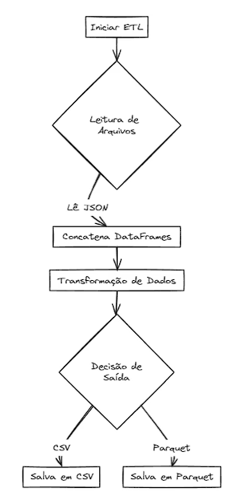

# ETL com Pandas, Json e Parquet
 

Para realizar uma ETL (Extract, Transform, Load) simples utilizando Python e a biblioteca Pandas, vamos seguir os seguintes passos:

Extract: Ler os dados de um arquivo JSON.

Transform: Concatenar os dados extraídos em um único DataFrame e aplicar uma transformação. A transformação específica dependerá dos dados, mas vamos assumir uma operação simples como um exemplo.

Load: Salvar o DataFrame resultante em um arquivo CSV ou PARQUET.
#
 

